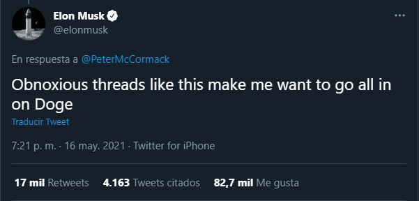
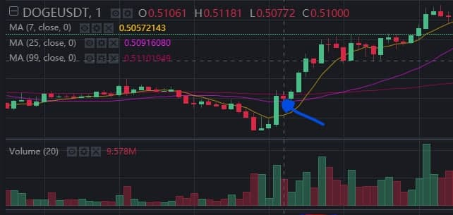
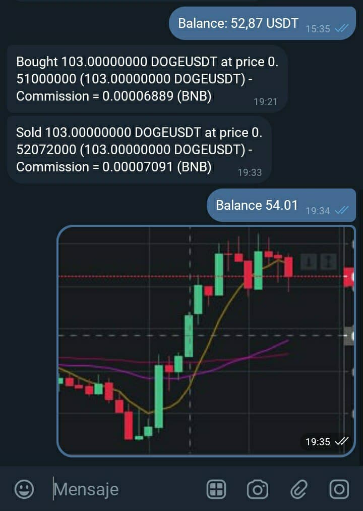

# Elon Doge and Shiba telegram Trading bot

Trading bot that buys Dogecoin and Shiba when Elon Musk tweets about it and sell it in minutes. The bot comunicates with you via telegram.

## Screenshots
When Elon tweets mentioning the Doge coin like this:



Then the bot buys, in this case the bot buys in this position (blue arrow):



And the it tells it to you via telegram:



  
## Tech Stack

**Server:** Node, Express

  
## Installation 

Create a new .env file based on env.default on the root folder and set up your credentials on it, then you are ready to launch the bot

```bash 
  npm install
  npm start
```
You can setup the minutes before sell the bought coin editing the MINUTES_TO_SELL constant in index.js, also can edit the paired coin to operate with the PAIR_COIN constant

## Contributing

Contributions are always welcome!

## Authors

- [@Mcheca](https://github.com/MCheca)

  
